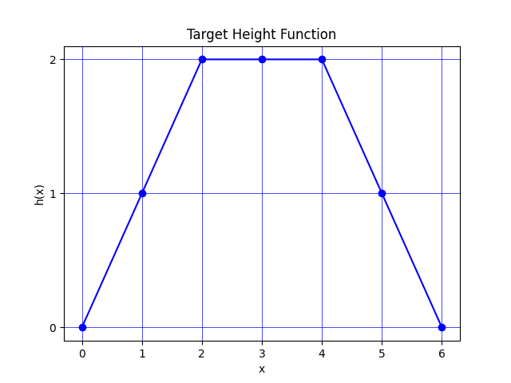
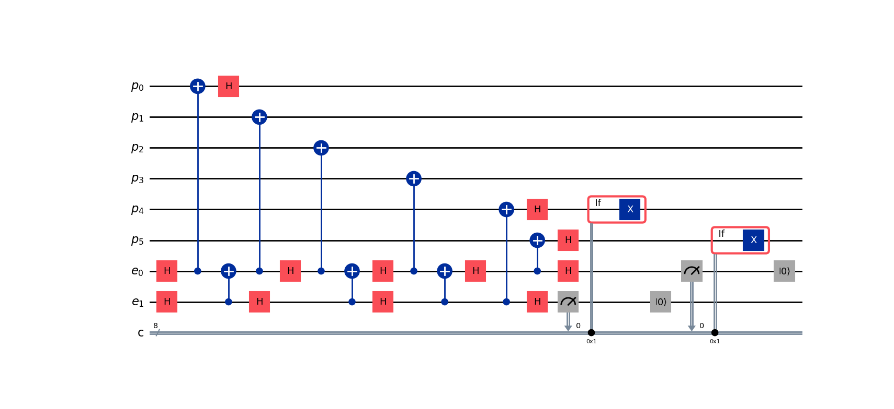

Getting Started (RREF)
======================

This page details how to get started with photonic_circuit_solver. This page covers the RREF function and the photonic circuit solving algorithm.

This is entire codebase relies on the Stabilizer class, so if you haven't already read that page first.

Installation
------------
To install photonic_circuit_solver and use the rref functions and supplemental functions, you will need photonic_circuit_solver installed in an environment with the following packages:

* Python 3.11 or superior
* NumPy
* Qiskit (optional)
* Matplotlib (optional)
* SymPy (optional)

As in Stabilizer, the core computation is all done using NumPy as native python data types, all optional packages are for visual and style utility. Qiskit is needed for any functions that output qiskit circuits, Matplotlib is needed for any plotting functions, and SymPy is needed for functions in the supplemental functions. 

RREF Gauge Choice
-------------------

The RREF Gauge
```````````````

In the Stabilizer section, we noted that the choice of generators for representing a stabilizer state is not unique. However, given a choice of generators, there is a way to bring it into a form that is similar to the upper triangular form of the RREF linear operation on matrices. This protocol is called the RREF algorithm, and further details can be found at https://doi.org/10.1088/1367-2630/7/1/170.

Note that even fixing a set of generators, the RREF gauge is still not unique. However, it does have some useful properties for our purposes.

First, fix some order of your generators. This is done inherently by the ``Stabilizer`` class since the tableau is a matrix with ordered rows.

To bring a set of stabilizers into RREF gauge, we note that we have N columns and K rows. For the purposes of this package, since the Stabilizer class enforces pure states, K = N, although this is not necessarily true for broader uses of the algorithm.

We also have an active region, denoted by the column NL and the row KU.

We start by setting NL = 1 and inspect the first column, and look at all the Paulis in the first column, i.e. inspecting the first entry in every generator. There should be one of two cases, there are only identities and one specific Pauli, or identities and at least two Paulis.

If we're in case 1, reorder the generators such that a generator with a non-identity Pauli are in row 1, and set KU = 1. Then, for all rows k such that k>KU, if the first entry of that generator is a non-identity Pauli, multiply that generator by the first generator and replace it.

In the code, this is done via the ``row_add`` method of the Stabilizer class.

If we're in case 2, reorder the generators such that a generator with the non-identity Paulis are in rows 1 and 2, and ensure that those Paulis differ. Set KU = 2, and for all k>KU, inspect the corresponding generator. If the first Pauli is an identity, do nothing. If it matches the Pauli in row 1, multiply them together and replace the kth generator with that, and similar with row 2. If it is the third pauli, multiply by both row1 and row2 and replace the kth generator with the new generator.

Then set NL=1, and follow the same steps (only inspecting Paulis for rows greater than the previous KU). If the column has only identities (which wasn't possible for column 1 but is possible afterwards), don't alter KU and just set NL+=1

Let's see the package implement this.

.. code-block:: python

    from photonic_circuit_solver import *
    state = Stabilizer(edgelist = [[0,1],[1,3],[3,2],[2,0],[1,2]])
    state.stabilizers()

returns

::

    ['XZZI', 'ZXZZ', 'ZZXZ', 'IZZX']

Now lets implement the RREF procedure. If you do the RREF procedure by hand, you should notice all we need to do is multiply row 2 into row 3, and then the generators will be in RREF gauge.

And as expected, following the above code with

.. code-block:: python

    rref(state)
    state.stabilizers()

returns

::

    ['XZZI', 'ZXZZ', 'IYYI', 'IZZX']

As expected.

Equivalently, RREF is a method implemented in the Stabilizer class. To replicate the above, one can also do.

.. code-block:: python

    from photonic_circuit_solver import *
    state = Stabilizer(edgelist = [[0,1],[1,3],[3,2],[2,0],[1,2]])
    state.rref()
    state.stabilizers()

For the sake of all future work, we are going to emit the hexagonal ring graph from the previous section.

.. image:: Plot5.jpg
  :width: 400
  :alt: Hexagonal Ring graph

As a reminder, this state can be generated by

.. code-block::

    state = Stabilizer(edgelist = [[i,(i+1)%6] for i in range(6)])

Entanglement Entropy and Required Emitters
```````````````````````````````````````````

The reason RREF is so useful is it lets us compute entanglement entropy by having an efficient way to compute the partial trace if we remove a selection of qubits. However, since the actual partial trace isn't as important to us as the entropy, this package doesn't come with the algorithm PTRACE. Details for that algorithm can be found in the above url for RREF.

We proxy the entanglement entropy by the so-called height function in (equation 1 in doi.org/10.1038/s41534-022-00522-6).

.. math::

    h(x) = n - x - |\{g_i:l(g_i)>x\}|

:math:`l(g_i)` is the leftmost index of a generator that contains a Pauli that isn't the identity. Henceforth, we will simply call these nontrivial Paulis.

This function effectively tells us how many generators have a nontrivial pauli further left than anticipated. This is a sign of entanglement, and thus requires an increase in the height function.

For the sake of clarity, :math:`h(x)` proxies the entanglement entropy of tracing out the qubits starting from 0 up to and including :math:`x-1`.

From this, we see that :math:`h(0)` and :math:`h(n)` trace out no qubits and thus has no entanglement entropy.

It turns out that, upon fixing an ordering of photons to be emitted, the minimal number of emitters required is just the maximal of this height function.

We can plot this using the ``plot_height()`` function

.. code-block:: python

    from photonic_circuit_solver import *
    state = Stabilizer(edgelist = [[i,(i+1)%6] for i in range(6)])
    plot_height(state)



From this, we note that we need at least 2 emitters to generate this state from solely emitters.

If we just want that number, we can call the ``num_emitters`` function.

.. code-block:: python

    from photonic_circuit_solver import *
    state = Stabilizer(edgelist = [[i,(i+1)%6] for i in range(6)])
    print(num_emitters(state))

The above code returns

::

    2

Circuit Solving Algorithm
--------------------------

Overview
`````````

This section outlines the circuit solving algorithm found here: doi.org/10.1038/s41534-022-00522-6

This section is a surface-level overview of the algorithm. I will make statements without proofs, since those proofs are found in the link above.

We want to generate this circuit from solely emitters. We're first going to establish some rules that our scheme follows.

* No photon-photon interactions allowed
* Photons only directly interact with emitters during the act of emission
* Single qubit (Clifford) gates are allowed on photons after emission and on emitters at any time
* Entangling (Clifford) gates are only allowed between emitters

For clarity, emitters are indexed by :math:`i_k` and the photon we're preparing to absorb is indexed by :math:`j`

We're going to generate the scheme backwards, starting from the graph state and zeroed out emitters and working backwards to the computational zero state. We do this because we model unabsorbed photons as being in the :math:`|0\rangle` state. We start by emitting photon :math:`j = n_p-1` and work backwards till :math:`j = 0`

We mimic photon absorptions computationally via a CNOT gate. If :math:`h(j+1)\geq h(j)`, one can verify that due to the RREF gauge there exists a generator whose leading nontrivial Pauli is at site :math:`j`. Meanwhile, by design of the algorithm (which we will get to a bit later), all the other photon sites after :math:`j` until the emitters are also trivial.

One thing to note, the original paper uses the quantity :math:`h(j)- h(j-1)` to determine this. This discrepancy is due to differences in photon indexing. The original paper indexes photons starting from 1, but to stay consistent with default python indexing this package index photons starting from 0.

However, if the above condition is satsified, we're guaranteed the existance of generator of the form :math:`g = \sigma_j^\alpha\sigma_{i_1}^{\beta_1}\ldots \sigma_{i_e}^{\beta_e}` where :math:`\alpha\in \{X,Y,Z\}` and :math:`\beta\in \{I,X,Y,Z\}`. This is important, because the existance of such a stabilizer implies that this photon is entangled solely with the emitters, and not with the other photons.

This generator can, through single qubit gates on the photon and through gates on the emitters, be transformed to :math:`g = \sigma^Z_j\sigma^Z_i`, where :math:`i` is the chosen emitter.

Then, noting that :math:`\text{CNOT}_{i,j}\sigma^Z_j\sigma^Z_i = \sigma^Z_j\text{CNOT}_{i,j}`, upon absorbing the photon, we have disentangled the photon. We then take that generator to clear the column so that for all other generators, :math:`\sigma_j = I`. This is why we could assume that on that generator, the paulis at all the sites after :math:`j` until the emitters are trivial, because those photons have already been absorbed and disentangled.

However, what if :math:`h(j+1)<h(j)`. This can be shown to mean that the photon is entangled with the other photons.

However, at this stage we assume that this photon is already emitted. This unfortunately means we can't directly break this entanglement, but we can indirectly via a time-reverse measurement.

It can be shown that the above condition implies there exists a generator :math:`g` where all nontrivial Paulis are on the emitters, and none are on the photons.

We then pick an emitter :math:`i` to measure, and through Clifford gates disentangle that emitter. This is done by applying gates such :math:`g` transforms into :math:`g = \sigma^Z_i`

The existance of such a generator implies that at this point in the algorithm, our state is of the form :math:`|\Phi\rangle\otimes|0\rangle_i`

We note that this is equivalent to taking the state :math:`\text{CNOT}_{ij}|\Phi\rangle\otimes|+\rangle_i`, measuring the emitter :math:`i` and measuring 0

It is also equivalent :math:`\text{CNOT}_{ij}|\Phi\rangle\otimes|+\rangle_i`, measuring a 1, then zeroing out the emitter and applying a correction X gate to the photon :math:`j`

As such, in the time reverse direction, we proxy (computationally) this by applying a Hadamard to the emitter :math:`i` and a CNOT between the emitter :math:`i` and the photon :math:`j`. It should be emphasized
that this is done for computational accuracy. In the actual time-forward circuit, this is just a measurement and a conditional gate, since we forbid direct photon-emitter interactions
other than the act of emission itself. It can also be shown that upon doing this time-reverse measurement, :math:`h(j+1)\geq h(j)` and thus we are ready for a photon absorption.

Regardless of whether or not a time-reverse measurement is needed, upon the absorbing of photon :math:`j` we move to absorbing photon :math:`j-1` until we've fully absorbed the entire graph state.

All the photons are now disentangled. We're now left with a set of emitter qubits entangled with each other. However, since on emitter qubits we're allowed to use entangling gates, this entangement can be directly broken up systematically. This package identifies the generator with least weight (least number of nontrivial Paulis) greater than 1, identifies an emitter to decouple, decouples that emitter, and then continues until all the emitters are disentangled.

However, note that want we to be in the computational zero state. This means all the signs of the generators need to be + (or equivalently, all the entries in the signvector are 0). This is easy to fix with emitters, but not as easy with photons since we can't act on the emitter prior to emission.

However, we can correct for the phase immediatly before absorption (or in the time forward direction, immediately after emission). Suppose that we're absorbing photon :math:`j`. By the algorithm described, prior to absorption the generator we're examining is of the form :math:`\pm\sigma_j^Z\sigma_i^Z`. Let's suppose its of the form :math:`-\sigma_j^Z\sigma_i^Z`. Then an :math:`X` gate on either the photon or emitter will correct this sign, and upon the photon absorption process the generator will
be of the form :math:`\sigma^Z_j`. Heuristically, we want to minimize the number of gates on the emitter, so this protocol involves doing this gate on the photon.

Following this procedure, we have now converted the photonic graph state and a set of zeroed out emitter qubits into the computational zero state. Now, the emission protocol is just reversing this circuit. For the time-reversed measurements, replace the CNOT and Hadamard with a measurement on the emitter, and depending on the measurement outcome a conditional :math:`X` gate on the photon. 
It's also important to correct for phase gates, since its not only non-hermitian unitary utilized by the algorithm. This algorithm records using the phase gate :math:`S`, but in reality implements :math:`S\dag` computationally so that :math:`S` is the proper gate in the time forward direction.

Implementation
````````````````

There are two functions that solve the circuit, which output different things depending on your preference. ``circuit_solver`` 
and ``qiskit_circuit_solver``. ``circuit_solver`` outputs a list of procedures to follow in a list format. ``qiskit_circuit_solver`` outputs a qiskit circuit object that encodes the same circuit. Both directly implement the circuit solving algorithm.

There is also ``qiskit_circuit_solver_alternate``, which implements the circuit solver algorithm indirectly. It calls ``circuit_solver`` to return a protocol, and then uses that protocol to generate the qiskit circuit, unlike ``qiskit_circuit_solver`` which generates it directly. In testing, it was found that 
for simple circuits, ``qiskit_circuit_solver_alternate`` was faster, whereas for more complicated circuits ``qiskit_circuit_solver`` tended to be faster, so both versions were kept.4

Lets implement these procedures using the example state above

.. code-block:: python

    from photonic_circuit_solver import *
    state = Stabilizer(edgelist = [[i,(i+1)%6] for i in range(6)])
    protocol = circuit_solver(state)

This generates the following list.

::

    [['H', 7], ['H', 6], ['Emission', 6, 0], ['CNOT', 7, 6], ['H', 7], ['H', 0], ['Emission', 6, 1], ['H', 6], ['Emission', 6, 2], ['CNOT', 7, 6], ['H', 7], ['H', 6], ['Emission', 6, 3], ['CNOT', 7, 6], ['H', 6], ['Emission', 7, 4], ['H', 7], ['H', 4], ['Measure', 7, 4], ['Emission', 6, 5], ['H', 6], ['H', 5], ['Measure', 6, 5]]

Note that this is a rather long list, despite this being a relatively simple circuit. For clarifications, qubits 0-5 represent the photons, and 6-7 are the two emitters.

If we want to just visualize this, we can instead use the qiskit methods

.. code-block:: python

    from photonic_circuit_solver import *
    state = Stabilizer(edgelist = [[i,(i+1)%6] for i in range(6)])
    qc = qiskit_circuit_solver(state)
    qc.draw(output = 'mpl')
    plt.show()

Which generates the following qiskit circuit.



Other functionalities
```````````````````````

There are a few other functions that one can utilize.

The first, one can find just the number of CNOT gates (between emitters) needed by calling the function ``num_cnots``

If one wants to know both the number of emitters and the number of CNOTs, one can also call the function ``emitter_cnot`` which returns an ordered list where the first entry 
is the number of emitters, and the second entry is the number of CNOTs.