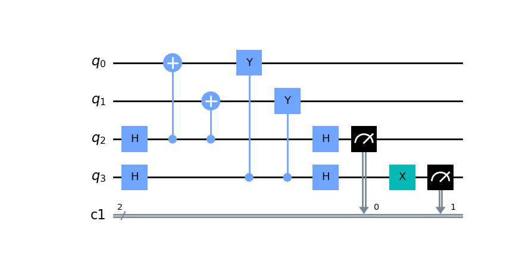

Getting Started (Stabilizer)
============================

This page details how to get started with photonic_circuit_solver. This page covers the Stabilizer class, designed to help use and manipulate stabilizer states

Installation
------------
To install photonic_circuit_solver and use the Stabilizer class, you will need photonic_circuit_solver installed in an environment with the following packages:

* Python 3.11 or superior
* NumPy
* Qiskit (optional)
* Matplotlib (optional)
* Pylatexenc (optional)

Note, all computational aspects are done in NumPy. You only need Qiskit if you want to use any of the methods that output Qiskit circuits. Similar for the SymPy methods. You only need Matplotlib and Pylatexenc if you want to plot the circuit outside of the shell. If you just want do do computation, or are fine with the circuits being drawn in the shell by qiskit, these are not required.

Once you have these packages installed, you can install photonic_circuit_solver in the same environment using
::

    git clone https://github.com/nrmanohar/photonic_circuit_solver.git
    cd photonic_circuit_solver
    pip install -e .

Theory
------

Background
```````````
Quantum states are very important for the purposes of quantum computing. However, one issue with representing quantum states is that they grow exponentially.

.. math::
    N = 2^n

For a standard pure quantum state, the size of the vector needed to represent it grows exponentially. Moreover, thats the size in :math:`\mathbb{C}^n`, which means storing it as real numbers involves even more data. However, there is a solution. It turns out a subset of quantum
states can be represented by a set of stabilizers rather than a state vector (or a density operator). Suppose we have a unitary operator

.. math::
    U = \bigotimes_i^n \sigma_i

Which is a Kronecker product of Pauli operators. Let's suppose we have some state such that


.. math::
    U|\psi\rangle = |\psi\rangle

We say that the operator :math:`U` stabilizes the state :math:`|\psi\rangle`. It turns out, for a stabilizer state, we can represent that state uniquely using :math:`n` stabilizers rather than a vector of size :math:`2^n`.


Group Theory
`````````````
For a crash course on group theory, a group is a set of elements with an associated binary operation (ex. the set of integers with the operation of addition) that abide by four properties

1. Closed under binary operation.
2. There exists an identity element.
3. For every element of the group, there exists an inverse.
4. The operation is associative.

| Closure means that if we do the binary operation to two elements in the group, the output remains in the group. The identity element is an element of the group that, under operation, leaves the element unchanged (like the number 0 in addition or the identity matrix). The inverse is an element of the group when operated with an element, returns the identity. And associativity just means that the grouping of terms do not matter. We're not going to go too deep into the math here, but for our purposes the groups we're using will operate under standard matrix multiplication
| Suppose we have a stabilizer state :math:`|\psi\rangle`. Let :math:`N=2^n` and :math:`G` be a group such that

.. math::
    G = \{P\in P(N):P|\psi\rangle = |\psi\rangle\}

Where :math:`P(N)\subseteq U(N)` such that for any :math:`M\in P`, :math:`M` is a tensor product of Pauli matrices. We say this is the stabilizer group for the state :math:`|\psi\rangle`. If you want, you can prove that :math:`G` is in fact a group. However, this doesn't really help us, since can be a very large set. But we have something else to help us.
Every group has a set of *generators*. We denote the set of generators as :math:`S`. We denote :math:`\langle S\rangle` as the set of all combinations of the elements of :math:`S`, and in and of itself form a group. If :math:`G = \langle S\rangle`, we say :math:`S` generates :math:`G`.
If we choose a generating set carefully, they can form our *representation* of the state. We can use :math:`n` matrices to represent the state instead of a :math:`2^n` size vector.

One may raise a concern that we're kicking the bucket down the road. After all, while we only need to track :math:`n` matrices, each of those matrices are :math:`2^n\times 2^n` dimensional. However, since these matrices 
are specifically elements of the Pauli group, we don't actually need the matrix itself. All we need is the string of Pauli matrices to tensor, and since Pauli matrices 
have very well defined properties, that is sufficient information to perform any procedure thats relevent.

One important thing to note, the set of stabilizers is not unique. For example, take the standard bell state :math:`|\psi\rangle = \frac{1}{2}(|00\rangle+|11\rangle)`. I can generate it's set of stabilizers from the generating set :math:`S = \{ZZ,XX\}`, but I can also generate the same set from the generators :math:`S=\{XX,-YY\}`

This is because the entire stabilizer group for the standard bell state is :math:`S(|\psi\rangle) = \{II, XX, ZZ, -YY\}`. Of the latter three matrices, choose any two and those will work as generators.

An important caveat, your stabilizers must be 'independent' of each other (sort of analogous to linear independence). What does that mean? Let's have a stabilizer state :math:`\ket{\psi}` with stabilizers :math:`\{g_1,g_2\ldots g_m\}`

If we generate a group from them we get :math:`G = \langle g_1,g_2\ldots g_m\rangle`

Here's the key, let's generate a group :math:`G' = \langle g_1\ldots g_{i-1},g_{i+1}\ldots g_n\rangle` where we removed one arbitrary generator. No matter which generater we removed, we should have :math:`G'\subset G`. In other words, removing one of the generators reduces the size of your group. If this is true, we say our generators are 'independant.'

For large states, it's hard to determine by inspection. However, this package comes pre-built with verification for independence of generators.

Density matrices
`````````````````
While we desribe pure states with a statevector :math:`|\psi\rangle`, we can also represent them by so called density matrices, traditionally denoted :math:`\rho`. For pure states, :math:`\rho = |\psi\rangle\langle\psi|`

Density matrices allow us to talk about both pure states and mixed states. Suppose we want to run a circuit on a machine that randomly spits out the :math:`|0\rangle` or the :math:`|1\rangle` state with equal probability (note, this is not the :math:`|+\rangle` state, this is an inherently probabilistic machine.)

We can write :math:`\rho = \frac{1}{2}|0\rangle\langle 0| +\frac{1}{2}|1\rangle\langle 1|`

In general, :math:`\rho = \sum_{i}p_i|\psi_i\rangle\langle\psi_i |` where :math:`|\psi_i\rangle` are pure states and :math:`\sum_{i}p_i = 1`

One can easily see that :math:`\text{Tr}(\rho) = 1`, and if we're talking about a pure state then :math:`\text{Tr}(\rho^2) = 1` as well. If we're talking about a mixed state, then :math:`\text{Tr}(\rho^2) < 1`

Another way to characterize how 'mixed' a state is is to use the Von Neumann entropy. The Von Neumann entropy of a state is :math:`S = -\text{Tr}(\rho\ln(\rho))`, or equivalently :math:`S = -\sum_ip_i\ln(p_i)` if in its most simplified form :math:`\rho = \sum_{i}p_i|\psi_i\rangle\langle\psi_i |`

The Von Neumann entropy is 0 if and only if a state is pure.

The partial trace of a density matrix is equivalent to removing a set of qubits. One can think of it as someone measuring all those qubits, but throwing out the measurement outcome.

Suppose we take our state and divide them into two sections, A and B. The entanglement entropy between the two sections is equivalent to the Von Neumann entropy of one of the sections if one traces out the other (it turns out they are equivalent.)

For an example, suppose we had a pure bell state :math:`|\phi\rangle = \frac{1}{\sqrt{2}}(|00\rangle+|11\rangle)` and we want to measure the entanglement entropy between the two qubits.

If someone measures the first qubit, and doesnt tell us the outcome, we're left with a mixed state that is 0 or 1 with equal probability, which we can represent as :math:`\rho = \frac{1}{2}(|0\rangle\langle 0|+|1\rangle\langle 1|)`

If one computes the Von Neumann of that mixed state, we get :math:`\ln(2)`

Suppose we instead had some weighted entangled state :math:`|\phi\rangle = \sqrt{\frac{99}{100}}|00\rangle+\frac{1}{\sqrt{100}}|11\rangle`. Following the same procedure as above, we get :math:`S = -(\frac{1}{100}\ln(\frac{1}{100})+\frac{99}{100}\ln(\frac{99}{100}))\approx 0.056`

From this we see that the second state is much less entangled than the first.

It turns out that the density matrix of a stabilizer state is actually easy to find. Suppose a stabilizer state is stabilized by generators :math:`\langle g_0,\ldots,g_n\rangle`.

Then the density matrix of the stabilizer state is :math:`\prod_{i=1}^n\frac{I+g_i}{2}`. Since the stabilizers commute, the order doesn't matter.

One should expect that the density matrix should be independant of the choice of generators, and in fact this is true. Suppose we index every element of the stabilizer group :math:`s_i`, where :math:`i` is an integer from 1 to :math:`N = 2^n`

Then we find that :math:`\rho = \frac{1}{N}\sum_{i=1}^Ns_i`, and any choice of generators can be shown to be equivalent to this.

The reason one may care about density matrices is that they are the more encompassing description of quantum states, and are important to the notion of entropy in the RREF section.

Clifford Operations
````````````````````
The Clifford group are the set of all operations that can be formed using CNOT, Phase (denoted as :math:`S` in the package), and Hadamard Gates. It turns out, applying a Clifford unitary on a stabilizer state converts it into another stabilizer state. Moreover, any stabilizer state can be realized from any other stabilizer state by means of clifford operations.
Now this package also allows for more operations. Consider the Pauli rotations

.. math::
    \sigma_z = S^2

.. math::
    \sigma_x = HZH = HS^2H

.. math::
    \sigma_y = SXS^\dagger=SHZHS^\dagger = SHZHS^3

So every :math:`\pi` rotation about an axis is a Clifford operator, and is thus built into our package. Similarly

.. math::
    \text{CZ} = (I\otimes H)\text{CNOT}(I\otimes H)

So the default Clifford operations this package utilizes are CNOT, H, S, X, Y, Z, and CZ gates.

Tableau Formalism
```````````````````
This package utilizes a way to represent :math:`S` as an :math:`n\times 2n` matrix given as

.. math::
    T=\left(\begin{array}{c|c}  
    X & Z
    \end{array}\right)

| Where the :math:`i` th row denotes the :math:`i` th stabilizer. Let's examine the :math:`X` and :math:`Y` matrices separately. Note these are both square :math:`n\times n` matrices. In each of these matrices, the :math:`j` th row denotes the :math:`j` th qubit.
| Let :math:`S_{i,j}` be the :math:`j` th Pauli of the :math:`i` th stabilizer (For example, if :math:`S_1=XZ` and :math:`S_2=ZX`, then :math:`S_{1,1}=X` and :math:`S_{2,1}=Z`). We denote the following using our Tableau

1. We denote :math:`S_{i,j}=I` as :math:`X_{i,j}=0` and :math:`Z_{i,j}=0`
2. We denote :math:`S_{i,j}=Z` as :math:`X_{i,j}=0` and :math:`Z_{i,j}=1`
3. We denote :math:`S_{i,j}=X` as :math:`X_{i,j}=1` and :math:`Z_{i,j}=0`
4. We denote :math:`S_{i,j}=Y` as :math:`X_{i,j}=1` and :math:`Z_{i,j}=1`

However, if you remember, a set of stabilizers for the standard bell state is :math:`S=\{XX,-YY\}`. Note the second stabilizer is :math:`-YY`. To account for this, we define a signvector, which denotes the sign of the :math:`i` th stabilizer. So with the signvector, we can denote this state as

.. math::
    T=\left(\begin{array}{cc|cc|c}  
    1 & 1 & 0 & 0 & 0\\
    1 & 1 & 1 & 1 & 1
    \end{array}\right)

| Where the last column represents the signvector.
| In this package, we use a numpy array to represent our Tableau. As such, we index from 0 to :math:`n-1` rather than from 1 to :math:`n`, and the signvector is a separate entity from the tableau

Examples
----------
Here's a sample code with the photonic_circuit_solver package

.. code-block:: python

    from photonic_circuit_solver import *
    state = Stabilizer()
    state.report()

which generates the output

::

    [[1. 1. 0. 0.]
     [0. 0. 1. 1.]]
    [0. 0.]

As you can see, this is the tableau for the standard bell state.

However, this isn't that useful. If you want to initialize :math:`n` qubits in the :math:`|0\rangle` state, we can instead say

.. code-block:: python

    state = Stabilizer(5)
    state.report()

which generates the output

::

    [[0. 0. 0. 0. 0. 1. 0. 0. 0. 0.]
     [0. 0. 0. 0. 0. 0. 1. 0. 0. 0.]
     [0. 0. 0. 0. 0. 0. 0. 1. 0. 0.]
     [0. 0. 0. 0. 0. 0. 0. 0. 1. 0.]
     [0. 0. 0. 0. 0. 0. 0. 0. 0. 1.]]
    [0. 0. 0. 0. 0.]

Let's do an example, building the GHZ state

.. code-block:: python

    state = Stabilizer(3)
    state.report()

Which generates the output

::

    [[0. 0. 0. 1. 0. 0.]
     [0. 0. 0. 0. 1. 0.]
     [0. 0. 0. 0. 0. 1.]]
    [0. 0. 0.]

We will then apply a Hadamard to the first qubit

.. code-block:: python

    state.clifford('h',0)
    state.report()

Which generates the output

::

    [[1. 0. 0. 0. 0. 0.]
     [0. 0. 0. 0. 1. 0.]
     [0. 0. 0. 0. 0. 1.]]
    [0. 0. 0.]

We then apply two CNOTs

.. code-block:: python

    state.clifford('cnot',0,1)
    state.clifford('cnot',1,2)
    state.report()

which generates the final tableau of

::

    [[1. 1. 1. 0. 0. 0.]
     [0. 0. 0. 1. 1. 0.]
     [0. 0. 0. 0. 1. 1.]]
    [0. 0. 0.]

However, if we have a complicated tableau, it might be hard to figure out what it's saying. Consider a state with the following tableau

::

    [[1. 0. 0. 1. 0. 0. 1. 1. 0. 0.]
     [0. 1. 0. 0. 1. 0. 0. 1. 1. 0.]
     [1. 0. 1. 0. 0. 0. 0. 0. 1. 1.]
     [0. 1. 0. 1. 0. 1. 0. 0. 0. 1.]
     [1. 1. 1. 1. 1. 0. 0. 0. 0. 0.]]
    [0. 0. 0. 1. 0.]

It's hard to make any sense of that. Fortunately, we have a method for that! If we had a state with the associated tableau, we can put

.. code-block:: python

    stabs=state.stabilizers()
    print(stabs)

and that generates the output

::

    ['XZZXI', 'IXZZX', 'XIXZZ', '-ZXIXZ', 'XXXXX']

which is a lot easier to understand.

Suppose we want a different set of generators for the same state. Well, if we multiply two generators together, and replace one of the two generators with that, we have a different set of generators that generate the same state.

This can be done via the ``row_add()`` method

.. code-block:: python

    state = Stabilizer()
    state.stabilizers()

returns

::

    ['XX','ZZ']

Now we do

.. code-block:: python

    state.row_add(0,1)

This encodes multiply the generators in row 0 and row 1 (in this case :math:`XX` and :math:`ZZ`) together and replacing row 1 with that.

If we then find the stabilizers

.. code-block:: python

    state.stabilizers()

returns

::

    ['XX','-YY']

One of the most used applications of stabilizer formalism is defining and manipulating graph states. This package comes with that too!

We need an edgelist

.. code-block:: python

    edges = [[0,1],[1,2],[2,3],[3,4],[4,5],[5,0]]

Each sublist represents a connection, between the two qubits numbered (indexed from 0 to :math:`n`-1)

Now if one types

.. code-block:: python

    state = Stabilizer()
    state.graph_state(edges)

This generates a stabilizer state equivalent to doing the following circuit on the computational zero state


One can also initialize a stabilizer state by

.. code-block:: python

    state = Stabilizer(edgelist = edges)

| Now let's look at stabilizer measurements. Let's make our stabilizer object

.. code-block:: python

    state = Stabilizer(2,'XX,-YY')

For both of the following examples. Now I want the circuit that measures the associated stabilizers. For that, I'll use the stabilizer_measurement() method

.. code-block:: python

    import matplotlib
    import matplotlib.pyplot as plt
    
    circ = state.stabilizer_measurement()
    circ.draw('mpl')
    plt.show()

Which generates the output


  

Note, if your state is generated properly, the stabilizer measurement should always return 0's, and the code is set up as such.
  
For making graph states, we can use the edgelist constructor directly at the initialization step. Let's make a hexagonal ring


This corresponds to an edgelist of [[0,1],[1,2],[2,3],[3,4],[4,5],[5,0]]

.. code-block:: python

    state = Stabilizer(edgelist = [[0,1],[1,2],[2,3],[3,4],[4,5],[5,0]])
    state.report()

Which generates the output

::

    [[1. 0. 0. 0. 0. 0. 1. 0. 0. 1.]
     [0. 1. 0. 0. 0. 1. 0. 1. 0. 0.]
     [0. 0. 1. 0. 0. 0. 1. 0. 1. 0.]
     [0. 0. 0. 1. 0. 0. 0. 1. 0. 1.]
     [0. 0. 0. 0. 1. 1. 0. 0. 1. 0.]]
    [0. 0. 0. 0. 0.]

If we write

.. code-block:: python

    stabs=state.stabilizers()
    print(stabs)

We get

::

    ['XZIIZ', 'ZXZII', 'IZXZI', 'IIZXZ', 'ZIIZX']

Measurement
````````````

Suppose one wants to measure a Stabilizer state. This package comes equipped with the ability to conduct measurements.

Note, this package forces knowledge of *pure* states, not mixed states. As such, each measurement needs a specific *measurement outcome* specified. If no outcomes are specified, the package assumes that the outcomes are all zero.

Also, the order of measurements matter, and is also encoded in the package.

Note, the package only implements the ability to measure a Pauli string (ex: computational measurement :math:`\{ZI,IZ\}` or bell stat measurements :math:`\{XX,ZZ\}`)

In the first case the measurement doesn't commute with some of the generators. Since these are Pauli matrices, not commuting is the same as anticommuting.

Suppose we're measuring stabilizer :math:`M`, and it doesn't commute with generators :math:`g_1,g_2`

However, :math:`M` commutes with :math:`g_1g_2` since :math:`Mg_1g_2 = -g_1Mg_2 = g_1g_2M`

So, by implementing `row_add`, we can find a new set of generators such that the measurement Pauli :math:`M` only anticommutes with one of the generators :math:`g_i`. If we replace :math:`g_i` with :math:`M`, where :math:`M` has a leading + sign if 
the measurement outcome is 0 and a - if it is 1, and that's the post-measurement state of the state.

For example, suppose we have the two qubit computational zero state, and we measure the stabilizer :math:`-XX`

.. code-block:: python

    from photonic_circuit_solver import *
    state = Stabilizer(2)
    state.measurement('XX',[1])
    state.stabilizers()

returns

::
    
    ['-XX', 'ZZ']

Which is a bell state, specifically :math:`\frac{1}{\sqrt{2}}|00\rangle - \frac{1}{\sqrt{2}}|11\rangle`

If the measurement Pauli :math:`M` commutes with all the generator, that means either :math:`M` or :math:`-M` is a member of the stabilizer group. As such, the state remains invariant under measurement. 
However, the package does not verify whether the measurement outcome specified matches what is to be expected.

The Inner Workings
-------------------
This section is more about the code of the package rather than the theory. Reading this section is not necessary for a background to use the package

Verification
`````````````
Since a lot of this package is self redundant, there needs to be a lot of verification to make sure your stabilizers are still up to standard

The first check is done by numpy itself. If your stabilizers don't form the right dimensions, it'll break numpy and return a numpy error.

The first real check done is to check whether the number of Pauli's in a stabilizer matches the number of stabilizers. This means checking whether each generator has the same number of Paulis as the number of qubits, and that there are as many generators as there are qubits. Note, this means we do not encode stabilizer subspaces, only stabilizer states.

The second check done by the package is an empty column check. That basically means whether or not you have a free qubit, which is not a unique state. 

The third check is commuter check, which takes :math:`\mathcal{O}(n^2)` time, checks that each stabilizer commutes with each other stabilizer. 

The fourth and final check is linear independence. There's a theorem in Nielson and Chuang that says the generators are independent if and only if the rows of the tableau are linearly independent. Utilizing them in conjunction will force all of our stabilizers to be valid to describe a unique state.

Clifford Manipulations
```````````````````````
Clifford manipulations on Tableau are known, so the package just implements them. There are many papers and textbooks that have them described, but here's how they are implemented. First, lets look at single qubit gates applied to some qubit j

A Pauli gate is the simplest to implement, since applying a Pauli gate doesn't change the stabilizers, just the signvector. This is computationally enforced by going through each generator and looking at the pauli at the jth index. If it is the identity or the same as the Pauli gate being implemented, alter nothing. If its a different Pauli, flip the signvector element associated with that generator.

Hadamard gates enforce the following transformations :math:`X\overset{H}{\rightarrow} Z\text{, }Z\overset{H}{\rightarrow} X, Y\overset{H}{\rightarrow} -Y`. This is enforced by swapping the jth column of the X side of the tableau and the jth column of the Z side of the tableau, and if both entries in the kth row are 1, flipping the signvector.

CNOT gates are trickier, but the key thing to note is that CNOT(XI) = XX(CNOT) and CNOT(IZ) = ZZ(CNOT), which we can generalize in the tableau as a bitwise addition of the columns associated with the two qubits, and putting it into the column of the target qubit on the X matrix and into the column of the control qubit in the Z matrix.

Phase gates don't affect Z Pauli due to commutation, and implement the chain :math:`X\overset{S}{\rightarrow}Y\overset{S}{\rightarrow}-X\overset{S}{\rightarrow}-Y\overset{S}{\rightarrow}X`, which is implemented by a bitwise addition of the jth column of the X matrix into the jth column of the Z matrix, and implementing sign changes if the initial state was stabilized by a Y Pauli.
